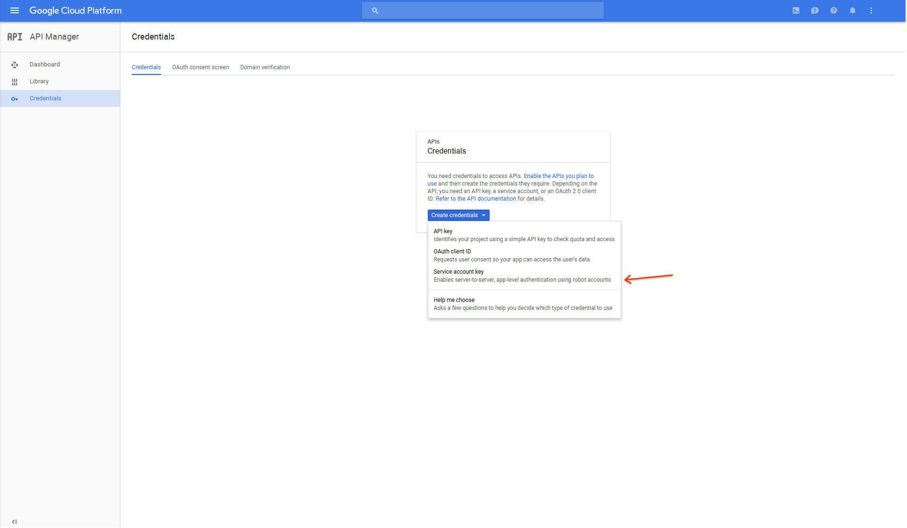
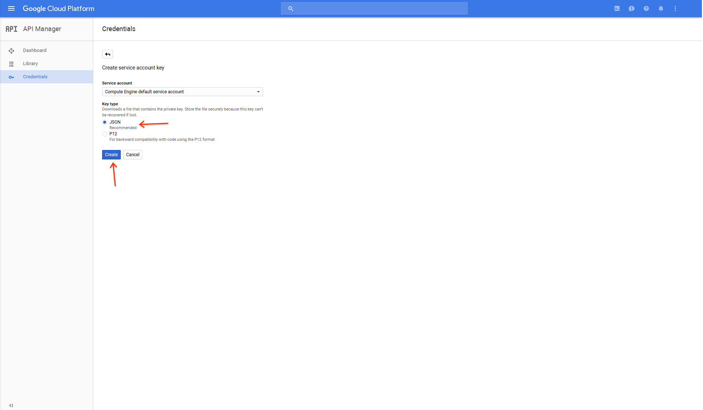

node-red-contrib-google-cloud **(ALPHA)**
=====================================

**_This is not an official Google product._**

[Node-RED](http://nodered.org) nodes for [Google Cloud Platform](https://cloud.google.com/).

## Installation

There are multiple ways to install `node-red-contrib-google-cloud`. The official ways are described in the Node-RED [documentation](https://nodered.org/docs/getting-started/adding-nodes).

## Google Cloud Credentials

| Property    | Type     | Description                                          |
| ----------- | -------- | ---------------------------------------------------- |
| **name**    | `string` | Label for easy idetification, essentially a comment. |
| **account** | `string` | Credentials in the form of a JSON key.               |

The credentials for a service account can be acquired from the [API Manager](https://console.cloud.google.com/apis/credentials). After you finish creating a service account key it will be downloaded in a JSON format.
Copy and paste the contents of the file directly into the **Key** field in the node editor.

## Google Cloud Pub/Sub

### Before You Begin

1. [Select or create a Google Cloud project.](https://console.cloud.google.com/project)
2. [Enable billing for your project.](https://support.google.com/cloud/answer/6293499#enable-billing)
3. [Enable the Pub/Sub API.](https://console.cloud.google.com/flows/enableapi?apiid=pubsub)

### Input

#### Node Properties

| Property                   | Type                       | Description                                                            |
| -------------------------- | -------------------------- | ---------------------------------------------------------------------- |
| **account**                | `google-cloud-credentials` | See [Google Cloud Credentials](#google-cloud-credentials)              |
| **topic**                  | `string`                   | Name of the topic to subscribe to.                                     |
| **subscription**           | `string`                   | Name of the subscription to create. If null one will be autogenerated. |
| **ackDeadlineSeconds**     | `integer`                  | Number of seconds to wait before attempting to redeliver a message.    |
| **encoding**               | `string`                   | Underlying encoding of the payload. Defaults to 'utf-8'.               |
| **interval**               | `integer`                  | Number of milliseconds between polling for messages.                   |
| **timeout**                | `integer`                  | Number of milliseconds before giving up on an HTTP request.            |
| **name**                   | `string`                   | Label for easy identification, essentially a comment.                  |

#### Message Properties

| Property                    | Type          | Description                                                                              |
| --------------------------- | ------------- | ---------------------------------------------------------------------------------------- |
| **payload**                 | `string`      | The payload passed as-is from the PubSub message.                                        |
| **time**                    | `date`        | The timestamp converted to the number of milliseconds since 1 January 1970 UTC.          |
| **project**                 | `string`      | The name of Google Cloud Platform project.                                               |
| **topic**                   | `string`      | The name of the topic in Google Cloud Platform.                                          |
| **subscription**            | `string`      | The name of the subscription in Google Cloud Platform.                                   |
| **resource**                | `string`      | The URI of the resource in the form of /projects/*project*/subscriptions/*subscription*. |

### Output

#### Node Properties

| Property    | Type                       | Description                                               |
| ------------| -------------------------- | --------------------------------------------------------- |
| **account** | `google-cloud-credentials` | See [Google Cloud Credentials](#google-cloud-credentials) |
| **topic**   | `string`                   | Name of the topic to publish to.                          |
| **name**    | `string`                   | Label for easy identification, essentially a comment.     |

#### Message Properties

| Property    | Type          | Description                                                                       |
| ----------- | ------------- | --------------------------------------------------------------------------------- |
| **payload** | `string`      | The payload passed as-is to the PubSub message.                                   |
| **time**    | `date`        | The timestamp converted from the number of milliseconds since 1 January 1970 UTC. |

## Troubleshooting

### After installing `node-red-contrib-google-cloud` the nodes are missing from the interface, where are they?

Refer to the Node-RED [documentation](https://nodered.org/docs/getting-started/adding-nodes) for adding nodes. If you used one of the methods described there and are still have trouble try
modifying the Node-RED [configuration](https://nodered.org/docs/configuration) with a more verbose logging level and run Node-RED from the terminal, if you are not already.
See the [running](https://nodered.org/docs/getting-started/running) Node-RED article for different ways of starting Node-RED.

### After installing `node-red-contrib-google-cloud` the logs contain errors about not finding the *grpc_node.node* module, what gives?

This issue usually comes up after installing `node-red-contrib-google-cloud` globally i.e. `sudo npm install -g node-red-contrib-google-cloud`. Some versions dislike running install scripts
as the root user and will silently fail to run the script, making the installation appear successful when in reality it failed. See [this issue](https://github.com/grpc/grpc/issues/6435) for more details.
The solution is to run the installation again, but append `--unsafe-perm` to the command i.e. `sudo npm install -g node-red-contrib-google-cloud --unsafe-perm`.
