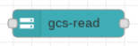

# Google Cloud Storage Read



This node reads the content of a Google Cloud Store (GCS) object and returns the content in the `msg.payload` field.  It has an additional option to list the objects in a bucket.

At runtime, the value of msg.filename contains describes the file to read.  The format of this field is a GCS Url of the form `gs://[BUCKET]/[FILE]`. 

## List notes

In the list mode, we are returned an array of metadata objects in the msg.payload.  This is the underlying GCS metadata object which contains a bunch of fields.  Of prime importance are:

* `bucket` - The name of the bucket hosting the object.
* `name` - The name of the file.
* `contentType` - The type of the data.
* `size` - The size of the data (as a string).

If we wish to iterate over the files, one possible technique is to include a function node following the GCS read which contains:

```
const ret = [];
msg.payload.forEach((element) => {
    ret.push({payload: element});
});
return [ret];
```
