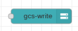

# Google Cloud Storage Write

This node writes the content of the payload to a Google Cloud Storage object. 

On execution, the data contained in `msg.payload` is written into the file specified by `msg.filename`.  The format of this field is a GCS Url of the form
`gs://[BUCKET]/[FILE]`. Optionally, the file to be written can be supplied as the file name property during configuration.  If both are supplied, the `msg.filename` will be used. 

An optional field called `msg.contentType` contains the MIME type to be associated with the file.  If this is not specified but a configuration property for content type is, then THAT will be used.  If neither are supplied, then we don't specify a content type for the GCS file.