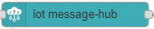

# IoT Message Hub

The GCP IoT Core allows one to send telemetry messages from the device to the Cloud, and receive config OR commands from the cloud.  
Telemetry messages can occur over either HTTP or MQTT.
Config/update reception can occur over MQTT.

In order to communicate with the cloud, we need to identify that device. The properties to identify it are the combination of:

* project id - The project hosting the registry.
* region - The region in which the registry is defined.
* registry id - The identity of the registry.
* device id - The identity of the device.

The device must also authenticate itself and needs to be supplied a private key corresponding to the public key associated with the device in the registry.

TELEMETRY EMISSION: The msg.payload field is the content that is sent as telemetry.
CONFIG/COMMANDS RECEPTION: the msg.topic contains the topic source and the msg.payload contains the actual config/command from the cloud