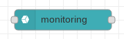

# Monitoring

The monitoring node provides the ability to record a monitoring record.  At run time, the value of `msg.payload` should be a monitoring value (usually a numeric).

At configuration time, we must provide some values:

* projectId - The identity of the project that holds the metric definition associated with the value we are recording.
* metricType - The type of the metric we are recording.

Stackdriver constrains the rate at which metrics may be written to a metric.  If we attempt to write faster than this, we will get an error:

`One or more TimeSeries could not be written: One or more points were written more frequently than the maximum sampling period configured for the metric.`

The exact rate isn't clear … it is believed to be no more than one write every 10 seconds.
