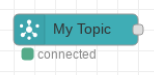

# PubSub In

This node receives a message that has been published to a topic.  During configuration, the property called `Subscription` is used to name the GCP Subscription that we are watching.

This is an event generating node and as such has no inputs.  When a message is received, the flowing msg will contain a payload property corresponding to a GCP Pub/Sub message data payload.  In addition, the msg.message will contain a read-only copy of the original message.  This is described [here](https://cloud.google.com/nodejs/docs/reference/pubsub/0.28.x/Message).  The message is auto acknowledged.

If we know that the incoming message contains a data payload that is JSON encoded, a configuration option called Assume JSON can be selected.  When selected, the content of the message is parsed from a JSON string to an object representation and stored at `msg.payload`.