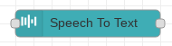

# Speech to Text

The speech to text node accepts a Buffer of data representing a fragment of audio.  This is supplied in `msg.payload`.  When the node executes, the audio is parsed through a speech recognition algorithm and the corresponding text representation is returned in the new `msg.payload` value.  The structure of the response is defined by the GCP Speech to Text API and is an instance of a [RecognizeResponse](https://googleapis.dev/nodejs/speech/latest/google.cloud.speech.v1p1beta1.html#.RecognizeResponse) object.

Processing an audio fragment takes time.  A status visualization is associated with the node which is visible when the node is processing audio.

The node has configuration options including:

* Language Code - The language code to be used for processing.  The set of allowed codes can be found [here](https://cloud.google.com/speech-to-text/docs/languages).  The default is en-US.
* Sample Rate - The sampling rate of the audio input.
* Encoding - One of:
 * LINEAR16
 * FLAC
 * MULAW
 * AMR
 * AMR_WB
 * OGG_OPUS
 * MP3
