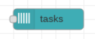

# Cloud Tasks

This node fires a new Cloud Task instance.  The configuration of this node contains:

* project id
* location
* queue
* url

When invoked, an instance is queued to the given task queue.  An optional `msg.scheduleTime` property can be used to schedule a task for execution in the future.  This is a date/time in string Zulu format.
