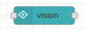

# Vision

This node is given an image as input and performs analysis on its content.  The node encapsulates the function of [Cloud Vision API](https://cloud.google.com/vision/docs/).  On invocation, it is given an image to process.  This can be either a Google Cloud Storage (GCS) file, a web URL or the binary content of an image.  When an image is examined, it is processed for distinct properties.  There is an execution cost associated with the examination of each property and if we simply don't need a property, it is wasteful to ask GCP to examine the image for it.  When configuring the node, we get to specify which of the properties of an image we care about.  These are configured as check boxes in the node's configuration settings.  Only the properties which are checked are processed.

The runtime input to the node is a Node-RED message from which we care about:

* `msg.filename` - The URL or GCS file name of the image to be processed.  If we have data for an image, specify msg.payload as the data and do not set `msg.filename`.
* `msg.payload` - A buffer of data containing the image we wish to process.  This is ignored if `msg.filename` is present.

Note: if `msg.filename` is present, that will be used in precedence to the `msg.payload`.

The node passed onwards a new message where `msg.payload` is an object conforming to the results of the Cloud Vision API [results](https://googleapis.dev/nodejs/vision/latest/google.cloud.vision.v1.html#.AnnotateImageResponse).
